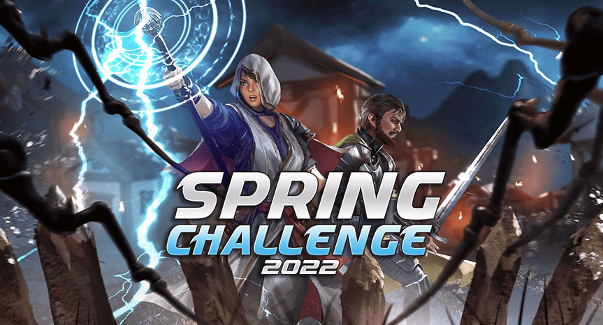

# CodinGame Spring Challenge 2022 -- Spider Attack

Here is my implementaion (in C++) for "CodinGame Spring Challenge 2022 (Spider Attack)". This
code reached to the 387th place (~ top 5%) in this competition.

It is intentionally open sourced "as-is" with the entire commit history: for study and/or
retrospective purposes. The code at its current stage is not quite neat and clean.
Additional iterations are desirable to tidy things up.

